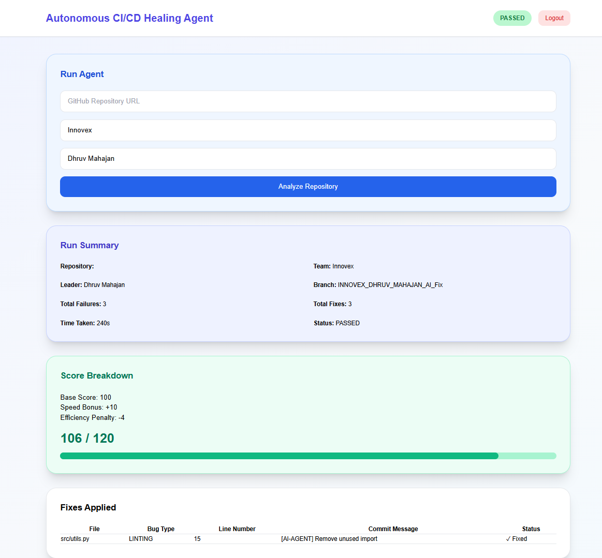
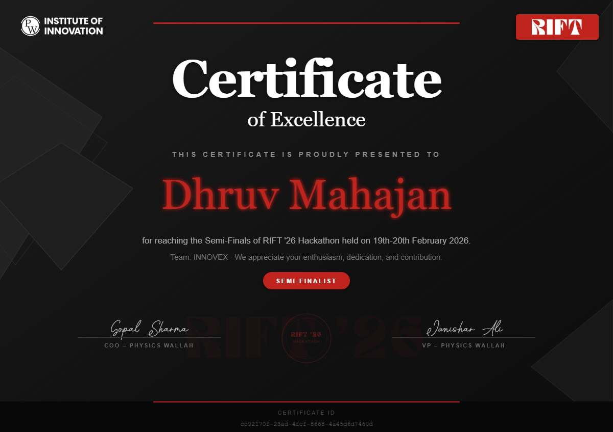

# 🚀 RIFT Hackathon Project

A full-stack web application developed during the RIFT'26 Hackathon by Team INNOVEX.  
This project was built collaboratively by a team of 4 members under tight hackathon deadlines, focusing on modern web development, deployment workflows, and scalable application architecture.

🌐 Live Demo: https://cicd-rift-hackathon-riya-sachan.netlify.app/  
💻 GitHub Repository: https://github.com/dhruvmahajan001/Hackthon

---

## 🏆 Achievement

🥈 Semi-Finalist at RIFT'26 Hackathon organized by Physics Wallah Institute of Innovation.

---

## ✨ Features

- ⚡ Modern responsive frontend
- 🔐 Authentication & secure workflows
- 🌐 Full-stack architecture
- 🚀 CI/CD deployment pipeline
- 📱 Mobile responsive design
- 👥 Team collaboration using Git & GitHub
- ☁️ Cloud deployment

---

## 🛠️ Tech Stack

### Frontend
- React.js
- Tailwind CSS
- JavaScript

### Backend
- Node.js
- Express.js

### Database
- MongoDB

### DevOps & Deployment
- GitHub
- CI/CD Workflow

---

## 📸 Screenshots

### Dashboard

<p align="center">
  
</p>

---

## 🏅 Hackathon Certificate

<p align="center">
  
</p>

---

## 👥 Team INNOVEX

This project was developed collaboratively during the hackathon by a team of 4 members, focusing on rapid development, teamwork, and innovative problem-solving.

---

## 🚀 Getting Started

### Clone the Repository

```bash
git clone https://github.com/dhruvmahajan001/Hackthon.git
```

### Navigate to the Project Folder

```bash
cd Hackthon
```

### Install Dependencies

```bash
npm install
```

### Start the Development Server

```bash
npm run dev
```

---

## 📚 Key Learnings

- Full-stack development
- Team collaboration in hackathons
- Git & GitHub workflow
- CI/CD concepts
- Deployment strategies
- Problem-solving under time constraints

---

## 🔥 Future Improvements

- Enhanced UI/UX
- More scalable backend architecture
- Advanced authentication
- Real-time features
- Performance optimization

---

## 👨‍💻 Developer

### Dhruv Mahajan

- GitHub: https://github.com/dhruvmahajan001
- LinkedIn: https://www.linkedin.com/in/dhruv-mahajan6969/

